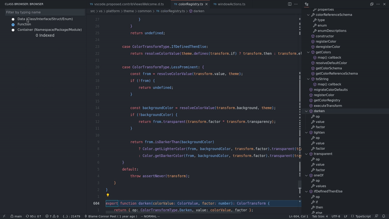

# Class Browser

A vscode extension which provides the Class browser for all languages. 
A class browser lists all the classes & its methods globally.

# Showcase

## Known Issues

## Release Notes
### 0.0.2
Added icons

### 0.0.1
- List all classes
- Open the class file and jump to its position
-----------------------------------------------------------------------------------------------------------
**Enjoy!**
